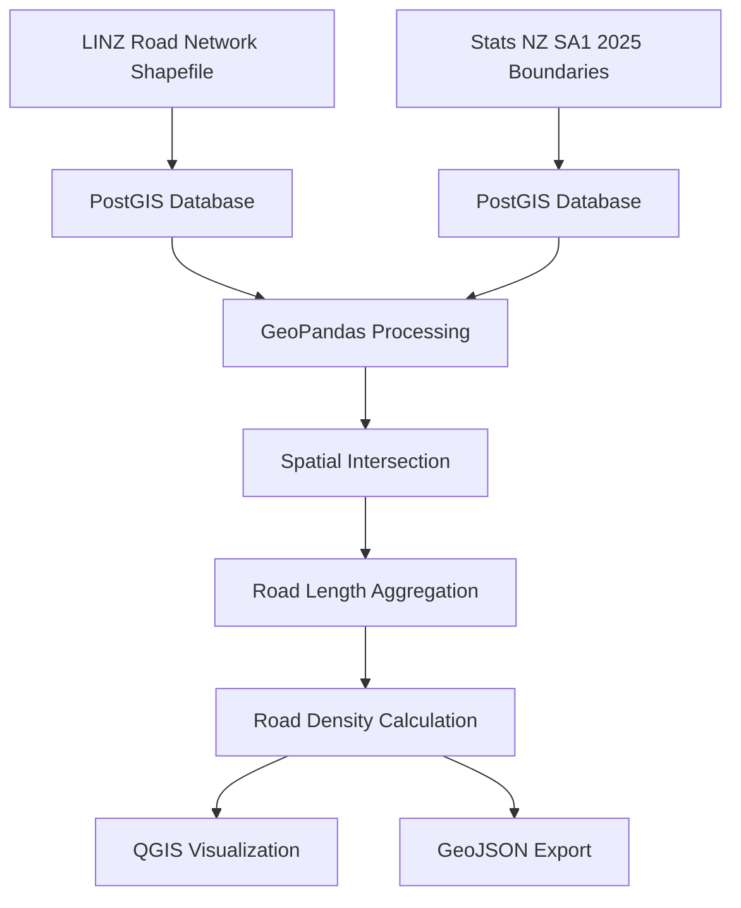

# New Zealand Road Network Analysis using PostGIS and GeoPandas

## This project demonstrates a complete GIS workflow using:

- PostgreSQL
- PostGIS
- GeoPandas
- Python
- GeoJSON
- QGIS

## Workflow



## Step 1. Spatial Database Setup 
A Linux-based spatial database environment was established using **VM, PostgreSQL 18, and PostGIS 3.6 (18)**. The PostGIS extension was enabled to support spatial data storage, indexing, and spatial SQL operations. GDAL was installed through **Conda** to provide the **ogr2ogr** data conversion utility. 

## Step 2. Import Road Network and SA1 Data into PostGIS 
The New Zealand road network dataset obtained from LINZ and the Statistical Area 1 (SA1) boundary dataset obtained from Stats NZ were converted from Shapefile format and imported into a PostGIS database as the primary spatial datasets for subsequent spatial analysis.

The data import process was performed using `ogr2ogr`, a GDAL command-line utility designed for vector data format conversion and loading spatial data into spatial databases.


Example command:

```bash
ogr2ogr -f "PostgreSQL" \
PG:"host=localhost dbname=git_sample user=<username> password=<password>" \
/path/to/nz-addresses-roads.shp \
-nln public.nz_addresses_roads \
-overwrite \
-lco GEOMETRY_NAME=geom \
-nlt PROMOTE_TO_MULTI
```


```bash
ogr2ogr -f "PostgreSQL" \
PG:"host=localhost dbname=git_sample user=wwj_postgis password=123456" \
/home/postgres/statsnz-statistical-area-1-2025-SHP/statistical-area-1-2025.shp \
-nln public.statistical-area-1-2025 \
-overwrite \
-lco GEOMETRY_NAME=geom \
-nlt PROMOTE_TO_MULTI
```

## Step 3. Exploratory Spatial SQL Analysis
Before performing spatial analysis, the road network dataset was explored using PostGIS SQL queries to understand its structure, attributes, geometry characteristics, and data quality.  

1) Count the Total Number of Road Features

The total number of road segments was calculated to understand the dataset size.

```sql
SELECT COUNT(*)
FROM nz_addresses_roads;
```


2) Preview Sample Records

```sql
SELECT *
FROM nz_addresses_roads
LIMIT 100;
```


3) Check Coordinate Reference System (CRS)


```sql
SELECT ST_SRID(geom)
FROM nz_addresses_roads
LIMIT 5;
```
```text
4167
```

4) Check Geometry Types

The geometry types stored in the road network table were examined to verify the spatial data structure.


```sql
SELECT DISTINCT ST_GeometryType(geom)
FROM nz_addresses_roads;
```
```text
ST_MultiLineString
```
5) Spatial Data Preparation
Transform EPSG:4167 → EPSG:2193

```sql
ALTER TABLE nz_addresses_roads
ADD COLUMN geom_2193 geometry(MultiLineString,2193);

UPDATE nz_addresses_roads
SET geom_2193 = ST_Transform(geom,2193);
```

6) Calculate Total Road Network Length

```sql
ALTER TABLE nz_addresses_roads
ADD COLUMN road_length float;

UPDATE nz_addresses_roads
SET road_length = ST_Length(geom::geography);
```


## Step 4. Connect PostGIS with Python
Python was integrated with the PostGIS database using **SQLAlchemy** and GeoPandas. A database connection was established to retrieve the road network table as a GeoDataFrame for further spatial processing and analysis.  

The analysis geometry was transformed to NZTM2000 (EPSG:2193) and stored as geom_2193 for metric-based spatial analysis.

Example workflow:

```python
# Python connection to PostgreSQL/PostGIS database
# Database: git_sample
# Dataset: LINZ New Zealand road network

import geopandas as gpd
from sqlalchemy import create_engine

# Create a connection to the PostgreSQL database
engine = create_engine(
    "postgresql://<username>:<password>@<host>:<port>/<database>"
)

# Read road network data from PostGIS into a GeoDataFrame
roads_gdf = gpd.read_postgis(
    "SELECT * FROM nz_addresses_roads",
    engine,
    geom_col="geom_2193"
)

print(roads_gdf.columns)
```


## Step 5. Exploratory Spatial Analysis Using GeoPandas
After connecting Python with the PostGIS database, GeoPandas was used to explore the road network dataset and understand its spatial characteristics, attribute structure, and data quality.

1) Explore Spatial Extent
The bounding box of the road network was calculated using GeoPandas to understand the geographic coverage of the dataset.

```text
array([1114406.69907759, 4793577.86861259, 2467495.46022585,
       6190127.52043692])
```

2) Calculate Road Segment Length
Road segment lengths were calculated from the projected geometry. The results were stored as a new attribute for further analysis. Summary statistics were calculated:

```text
max 2145095.1329076597
min 8.087625506798597
mean 1561.8530384064586
95th percentile 6420.3725884673295
```

3) Visualize Road Length Distribution


5) Check Missing Values

```python
roads_gdf.geom_2193.isnull().sum()
```

## Step 6. Spatial Overlay and Road Density Analysis
Integrate the road network with Statistical Area 1 (SA1) boundaries to calculate road distribution and road density at the small-area level.
Instead of simply assigning roads to SA1 polygons using a spatial join, this step applies spatial intersection to split road geometries at SA1 boundaries. This ensures that road lengths are accurately allocated to the corresponding statistical areas.  

1) Spatial Intersection between Roads and SA1

```python
roads_sa1_gdf = gpd.overlay(roads_gdf, sa1_gdf, how="intersection")
```
The resulting dataset contains:

- Road segment geometry
- Corresponding SA1 identifier
- Attributes inherited from both datasets


2) Calculate Road Segment Length
Because the data is stored in NZTM2000 projection (EPSG:2193), geometric length calculations are performed in metres.

```python
roads_sa1_gdf["roads_length_intersected"] = roads_sa1_gdf["geometry"].length
```


3) Aggregate Road Length by SA1
Road segments were aggregated by SA1 identifier to calculate the total road length within each statistical area.

```python
road_summary = roads_sa1_gdf.groupby("sa12025_v1").agg(
    total_road_length=('roads_length_intersected', 'sum')).reset_index()
```


4) Calculate Road Density

```python
sa1_gdf['road_density'] = sa1_gdf['total_road_length'] / sa1_gdf['geom'].area
sa1_gdf['road_density']
```


